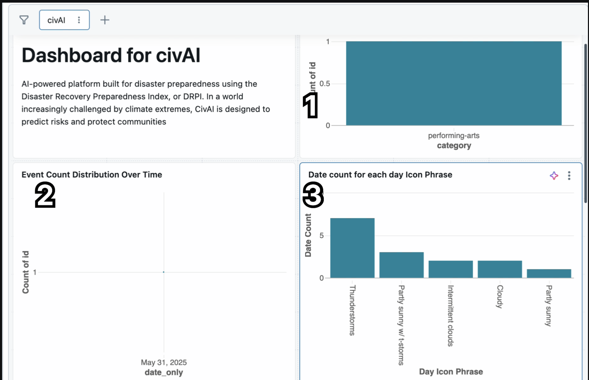
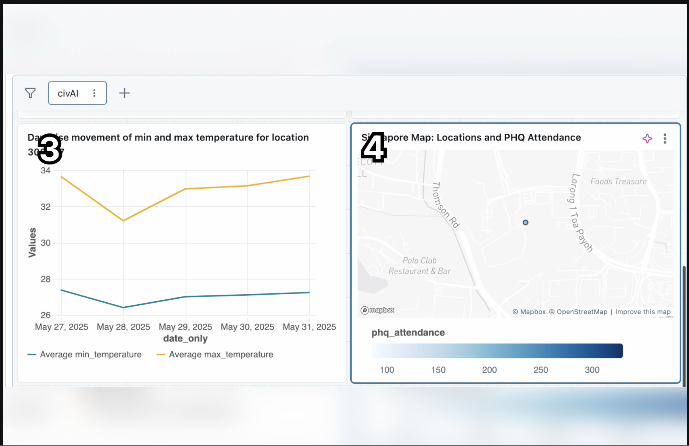
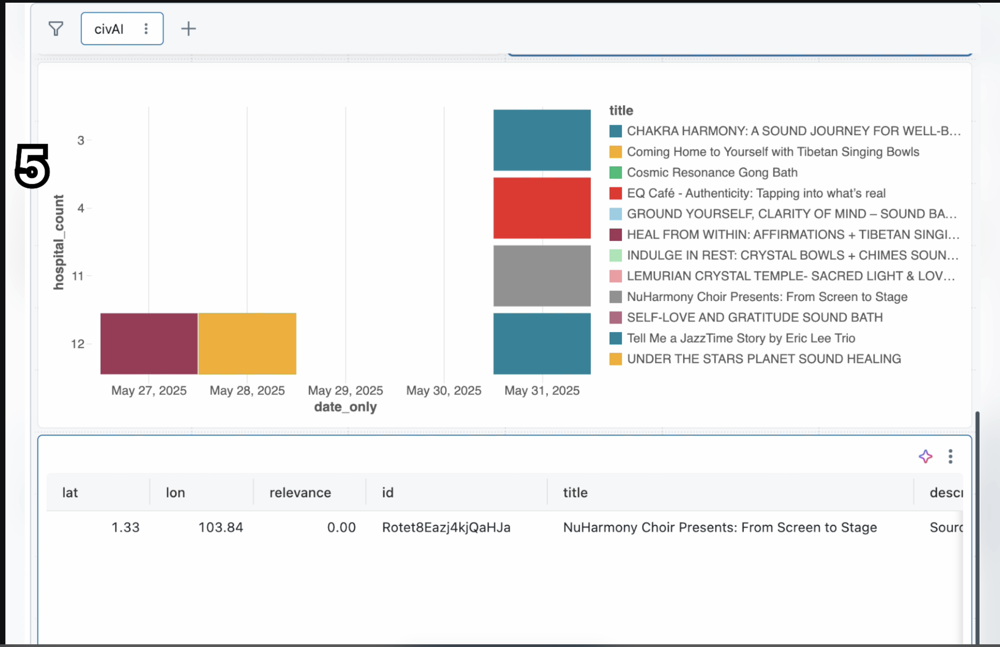
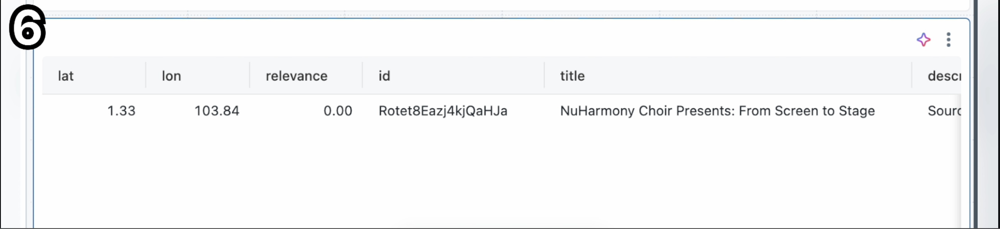

# 🌐 DRPI System – Disaster Risk Prediction and Integration

## Overview

CivAI : AI powered Dashboard build for diaster preparedness using the DRPI.
In the world increasingly challenged by climate extremes , 
CivAI is designed to predict risks and protect communities.

---

## 🎯 Solution Objectives

    a) No. of upcoming  events in singapore based on category.
    b) Event count distribution over time.
    c) Days count based on weather.
- 

    c) Day wise movement of temperature based on a location.
    d) Location and PHQ attendence on singapore map.
- 

    e) Hospital count in the proximity of radius 5 km arounf the event location.
- 

    f) Full detail of events.
- 

Built with ❤️ and Databricks by Team Analytics Ashram — May 2025