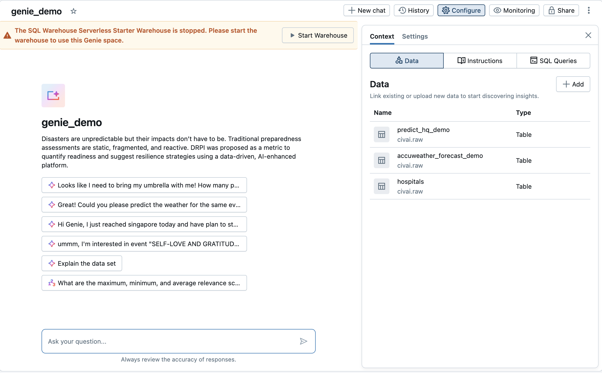
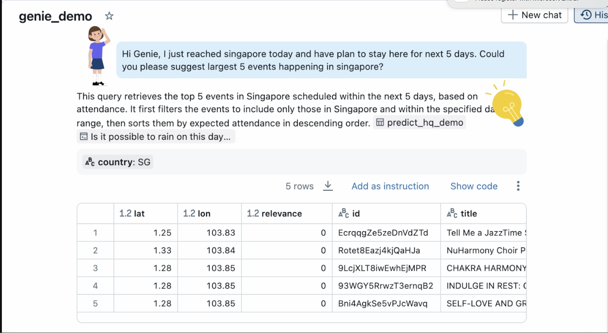
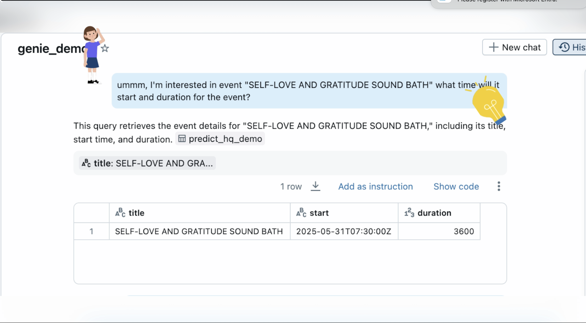
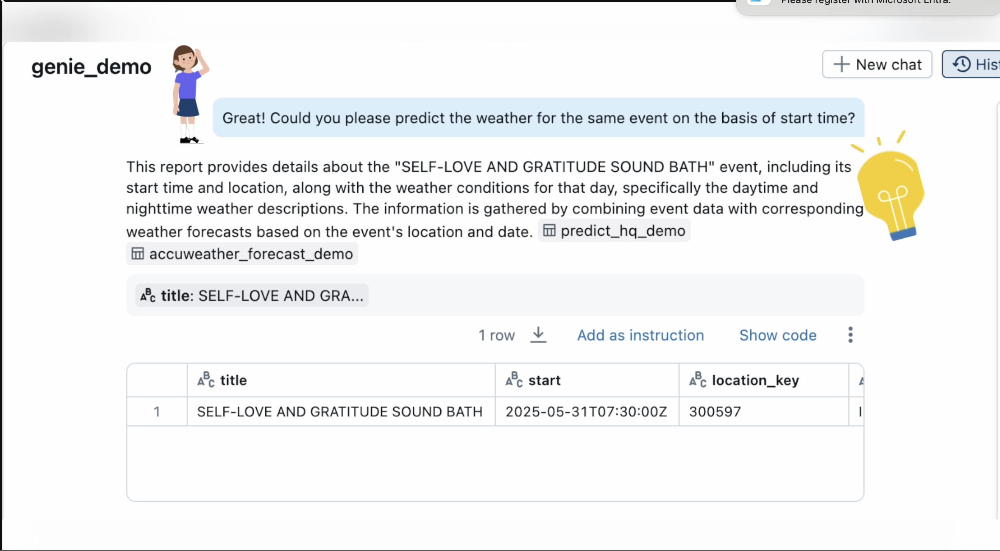
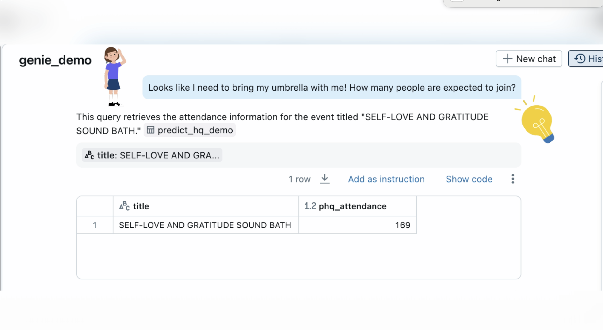
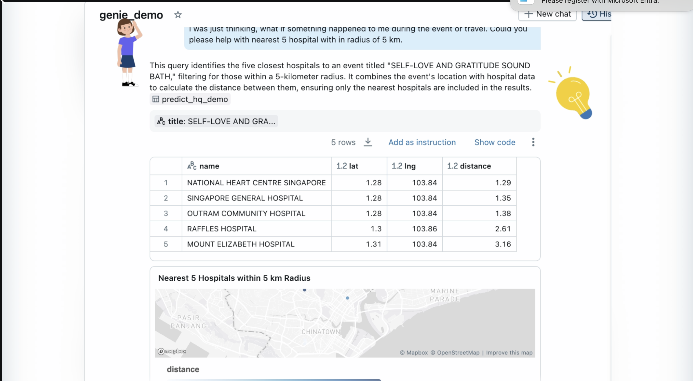

# 🌐 DRPI System – Disaster Risk Prediction and Integration

## 🧠 Genie Space Purpose 
Use this Genie space to:

🔍 Query upcoming events in Singapore: Stay updated with local concerts, festivals, and public gatherings.

🌤️ Access weather forecasts: Retrieve current and forecasted weather conditions relevant to event planning.

🏥 Analyze proximity to hospitals: Evaluate the accessibility of nearby medical facilities for public safety and emergency response.

---

## 🎯 Solution Objectives
Here, The Genie Space to help you avoid query path and answers REAL question 
required to take business or individual decision.
- 

Using PredictHQ dataset to get information on upcoming events.
- 

Using PredictHQ dataset to get information on upcoming events and its detail information like start time ,
duration and location for the same.
- 

Using Accuweather Dataset to predict the weather condition for upcoming events.
- 

Using PredictHQ dataset to get information on predicted headcount for the event(s).
- 

Taking hospital dataset to get information on hospital on proximity of 5 km radius.
- 

Built with ❤️ and Databricks by Team Analytics Ashram — May 2025