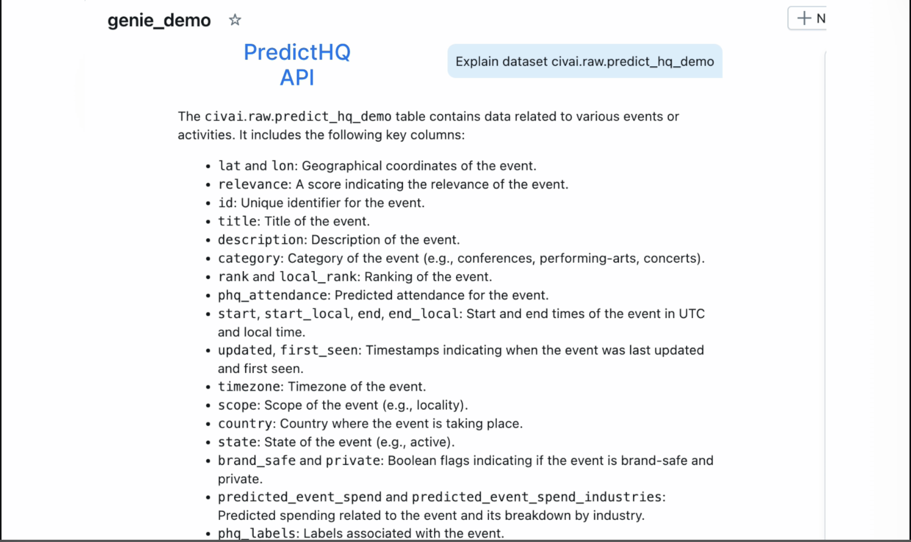
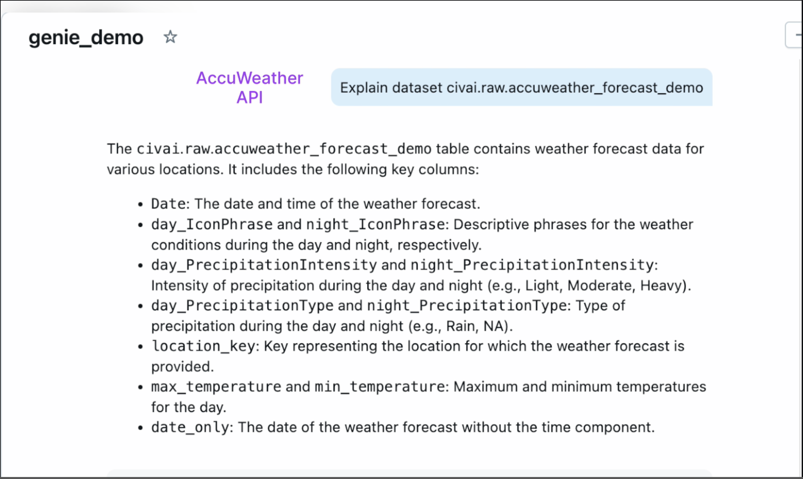
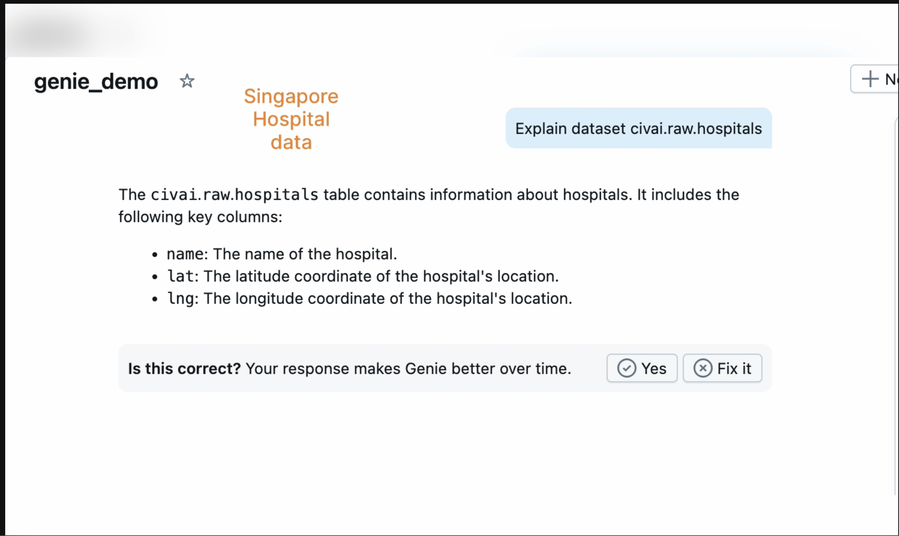

# 🌐 DRPI System – Disaster Risk Prediction and Integration

## Overview

The **Disaster Risk Prediction and Integration (DRPI)** system is a unified, scalable platform built to forecast and monitor public risk across geographic regions. It leverages weather, event, and social determinants of health (SDOH) data to enable proactive disaster response and situational awareness.

This solution integrates data ingestion, harmonization, feature engineering, risk scoring, and real-time insights into a streamlined data pipeline, powered by Delta Lake and Databricks.

---

## 🎯 Solution Objectives

- 🔄 **Ingest and unify** heterogeneous data from public APIs and government sources.
- 🧠 **Normalize and enrich** raw datasets to produce meaningful, structured features.
- 📊 **Compute a composite DRPI score** with rule-based and ML-enhanced models.
- ⚡ **Provide real-time insights** through dashboards, APIs, and alerting tools.
- 🔐 **Enable governance and scalability** using Unity Catalog and Delta Lake.

---

## 🧱 Architecture Components

### 1. 📡 Sources / APIs

| Source | Description |
|--------|-------------|
| 🌤️ **Accuweather API** | 5-day weather forecasts including temperature and hazard conditions. |
| 🗓️ **PredictHQ API** | Real-time public event data: concerts, sports, disruptions. |
| 🏛️ **Singapore Gov Data** | Census-based socio-demographic and health data (SDOH). |

**PredictHQ API**

**Accuweather API**

**Singapore Gov Data Dataset**

All APIs are integrated using Databricks notebooks, with secure token-based access.

---

### 2. 🪣 RAW Layer (Bronze)

- Raw data ingested and stored in Delta Lake tables:
  - `accuweather_forecast`
  - `predict_hq_events`
  - `sdoh_age_population`
- Data is retained in its original format for audit, traceability, and replay capabilities.
- Bronze tables form the foundation for downstream data transformations.

---

### 3. 🔁 Harmonization Layer (Silver)

- Converts raw ingested data into standardized and structured formats.
- Modules include:
  - 🌐 Temporal and geo-standardization
  - 🧱 Flattening and parsing complex nested JSON
  - 🔍 SDOH feature extraction
- Output is stored in Delta format for traceability and versioning.

---

### 4. 🧮 Feature Enrichment Layer

- Aggregates and joins datasets to create a unified feature set:
  - 🗺️ Geo-spatial joins (event ↔ weather ↔ SDOH)
  - ⏱️ Rolling aggregations (e.g., 3-day moving temperature avg)
  - 🧬 Feature engineering for risk scoring
- Output: `unified_feature_enriched_table` (Delta)

---

### 5. 🧠 DRPI Computation Engine

- Calculates a unified disaster risk score: DRPI = w1 * Hazard_Score + w2 * SDOH_Score
- Can be enhanced with:
- 📈 ML-based anomaly detection or prediction models
- 🧮 Configurable weights based on use case or domain
- Results are stored in the Gold Layer as `drpi_score_table`.

---

### 6. 🪙 Gold Layer: DRPI Delta Table

- Final enriched dataset including:
- All raw and derived features
- Hazard & SDOH scores
- Final DRPI score
- Partitioned by `date` and `location`
- Ready for consumption via BI, APIs, or apps

---

### 7. 🧾 Consumption Layer

| Tool | Purpose |
|------|---------|
| 🤖 **Genie Spaces** | Unified AI dashboard interface |
| 📊 **Unified BI Dashboard** | Risk heatmaps, temporal trends |
| 📣 **Databricks Alerts** | Triggers based on DRPI thresholds |
| ⚡ **FastAPI Services** | API endpoints to expose risk insights |

---

## 🚀 Key Features & Innovations

- 🔄 **End-to-End Pipeline** from data ingestion to dashboard consumption
- ☁️ **Cloud-Native & Scalable** using Databricks and Delta Lake
- 🧩 **Real-time Risk Composition** from weather, events, and SDOH
- 🔐 **Governed & Secure** with Unity Catalog and audit trails
- ⚙️ **Modular & Extendable** pipeline for new data sources or ML models

---

## 🛡️ Platform Integration & Governance

Built entirely on **Databricks**, leveraging:

- 🗃️ **Delta Lake** for ACID-compliant, scalable storage
- 🛡️ **Unity Catalog** for fine-grained access control and lineage
- ⚙️ **Job Orchestration** with Databricks Workflows

---

## 📌 Use Cases

| Use Case | Description |
|----------|-------------|
| 🏥 Disaster Preparedness | Proactively forecast hazard-prone areas |
| 🧭 Health Equity Mapping | Assess exposure of vulnerable populations |
| 🚨 Early Warning Alerts | Notify responders for critical risks |
| 🏙️ Urban Planning | Guide decisions using DRPI scores |

---

## 🔭 Future Roadmap

- 🌐 **Integrate streaming data** (e.g., IoT sensors, satellite feeds)
- 📱 **Mobile App for Public Alerts**
- 🤖 **AutoML Models for Risk Forecasting**
- 📡 **Webhook Integrations** with Emergency Services

---

## ✅ Summary

The **DRPI System** is a next-gen, AI-enabled risk intelligence platform. It helps cities, public health authorities, and disaster management teams:

> "Anticipate risks. Act faster. Save lives."

With full-stack pipeline automation, rich feature engineering, and a scalable governance-first architecture, DRPI sets a new benchmark for disaster preparedness and public health resilience.

---

---

Built with ❤️ and Databricks by Team Analytics Ashram — May 2025