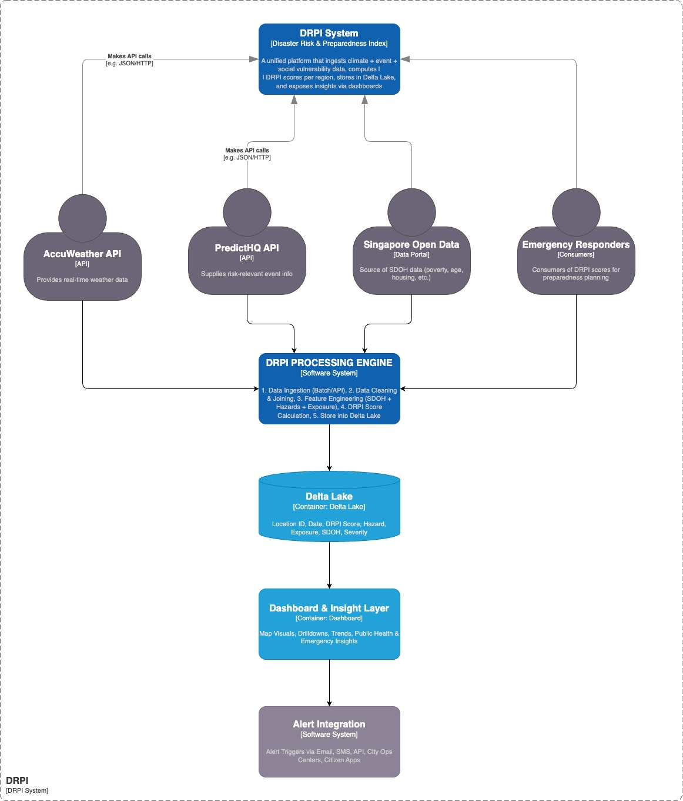
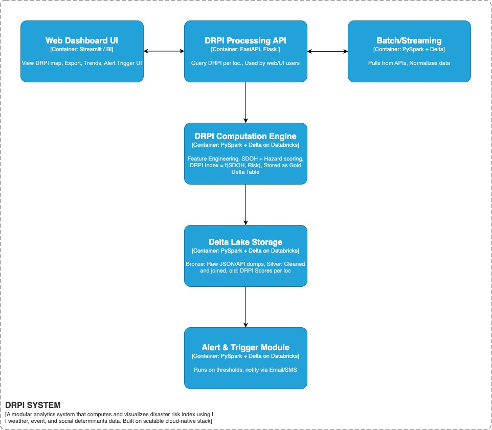
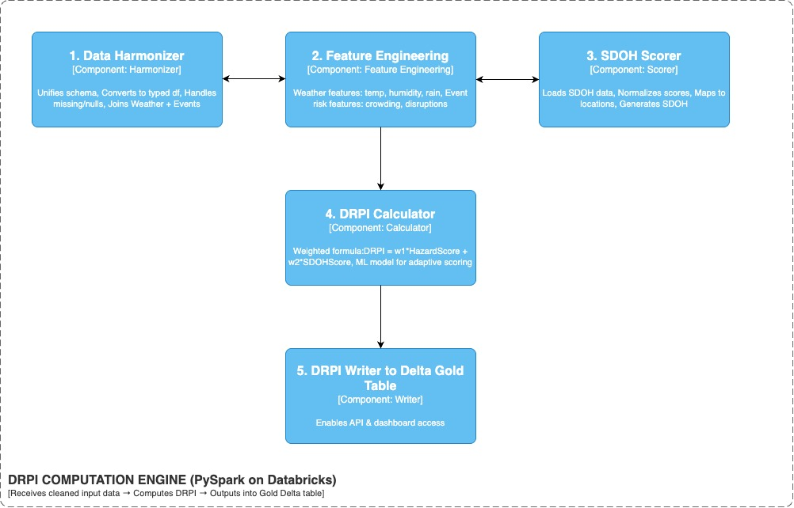

# 🏗️ Architecture and Design – DRPI System

This document outlines the software architecture of the **Disaster Risk & Preparedness Index (DRPI)** system. We leverage the **C4 Model** to describe our system at various levels of abstraction:

- **C2: Container View** – System-wide containers and interactions
- **C3: Component View** – Internal modules of major containers
- **C4: Code/Function View** – High-level code responsibilities per component

---

## 📦 C2: Container View – DRPI System Landscape

The DRPI platform consists of multiple cooperating containers designed to provide a modular, scalable, and maintainable system.

### 🧱 Containers and Responsibilities:

| Container | Technology | Purpose |
|----------|-------------|---------|
| **Batch/Streaming** | PySpark + Delta | Pulls data from APIs (Weather, Events, SDOH), normalizes raw inputs |
| **DRPI Computation Engine** | PySpark on Databricks | Core logic: Data harmonization, feature extraction, scoring |
| **Delta Lake Storage** | Delta Lake on Databricks | Stores bronze, silver, and gold data layers |
| **DRPI Processing API** | FastAPI, Flask | Serves DRPI scores and trends to UI/consumers |
| **Web Dashboard UI** | Streamlit, BI Tools | Visualization interface for alerts, trends, and maps |
| **Alert & Trigger Module** | PySpark + Delta + Email/SMS APIs | Rule-based alert generation, notifies stakeholders |

### 🔄 Data Flow:

1. APIs (AccuWeather, PredictHQ, Gov Data) → Batch/Streaming Ingestion
2. Harmonized data sent to DRPI Computation Engine
3. Output stored in Delta Lake (Gold Layer)
4. Data exposed via APIs and visualized in Dashboard UI
5. Alerts triggered as needed via email/SMS

---

## ⚙️ C3: Component View – DRPI Internal Structure

This level breaks down the **DRPI Computation Engine** into logical sub-components that operate within Databricks Notebooks or Python modules.

### Key Components:

#### 1. 🧽 Data Harmonizer
- Unifies schemas across APIs
- Cleans and reshapes nested data (e.g., weather and event JSON)
- Outputs structured weather, event, and SDOH datasets

#### 2. 🧬 Feature Engineering
- Derives rolling averages (e.g., 3-day temperature)
- Constructs geo-temporal event impact metrics
- Integrates SDOH features by location and time

#### 3. 📊 SDOH Scorer
- Normalizes SDOH features from census data
- Maps features to regional clusters
- Generates SDOH vulnerability scores

#### 4. 🧠 DRPI Calculator
- Calculates risk score using:
DRPI = w1 * Hazard Score + w2 * SDOH Score

- Supports optional ML-based enhancements
- Enables adaptive scoring logic per domain

#### 5. 🪙 DRPI Writer
- Writes final outputs to the **Gold Table**
- Partitioned by `date` and `location`
- Enables real-time access by dashboard/API

---

## 🧩 C4: Code/Functionality View – Logic Responsibilities

Each functional unit inside the DRPI Engine is designed as a reusable notebook or module inside the Databricks repo.

| Function | Description |
|---------|-------------|
| `ingest_weather.py` | Pulls weather forecasts via Accuweather API |
| `ingest_events.py` | Pulls event data from PredictHQ |
| `ingest_sdoh.py` | Reads SDOH datasets from open government sources |
| `weather_normalizer.py` | Parses, flattens and stores weather data to Bronze table |
| `event_normalizer.py` | Similar logic for events, with category mappings |
| `sdoh_parser.py` | Transforms demographics into regional scores |
| `feature_engineering.py` | Computes moving averages, location-event joins |
| `drpi_score.py` | Computes hazard, SDOH, and composite DRPI score |
| `gold_writer.py` | Writes final DRPI dataset to Gold Delta Table |
| `alerts_trigger.py` | Triggers email/SMS/Slack alerts for high DRPI zones |
| `serve_api.py` | FastAPI endpoints for querying DRPI scores |
| `dashboard_app.py` | Visualizes DRPI metrics via Streamlit or Dash |

---

## 🧱 Storage Layers – Delta Lake

- **Bronze**: Raw ingested API data (audit-ready)
- **Silver**: Harmonized, structured features (clean & enriched)
- **Gold**: Final DRPI scores (partitioned, consumable)

---

## 🧠 Design Principles

- **Modular architecture**: Enables component reusability and isolated testing
- **Separation of concerns**: Each stage of pipeline has a distinct responsibility
- **Delta-first design**: Ensures versioning, ACID compliance, and scalability
- **Event-driven alerts**: Rules can evolve independent of scoring logic

---

## 🔐 Security & Governance

- Role-based access control (RBAC) with Unity Catalog
- Tokenized API access for external consumers
- Audit logs for all dataset accesses and updates

---

## 🧭 Summary

This architecture ensures that DRPI is:
- Scalable: Handles real-time and batch data
- Maintainable: Clear container boundaries
- Insightful: Computed scores that drive public health decisions
- Actionable: Automated alerts and live dashboards

