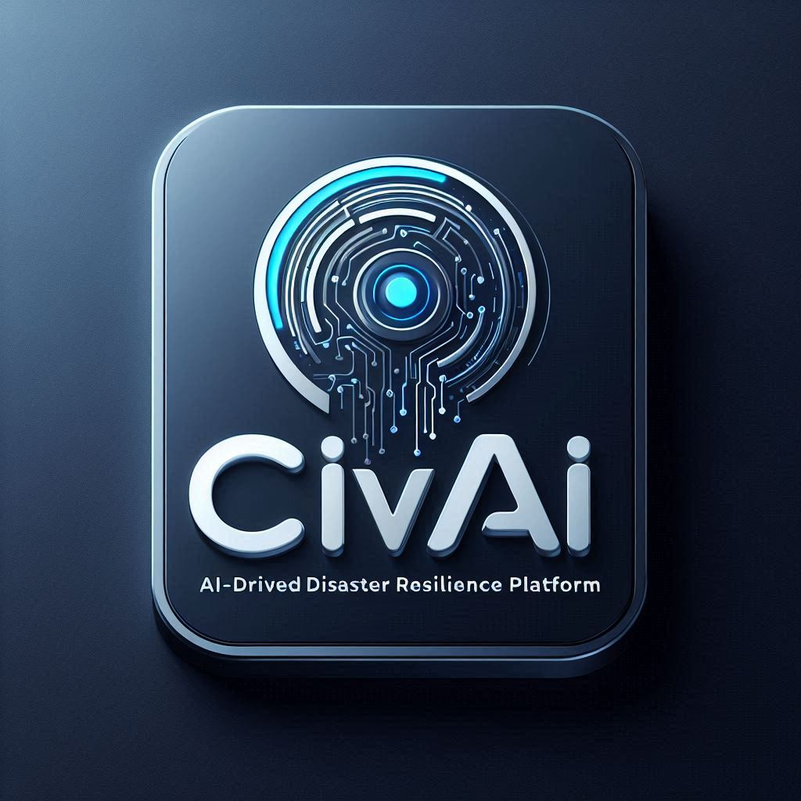

---

# 🚨 CivAI — DRPI-Powered Resilience Intelligence System
### A Smart Disaster Preparedness and Response Platform powered by GenAI & BI — Team: Analytics Ashram

---

## 🔍 Hackathon Overview

This project was developed for the [Databricks Smart Business Insights Challenge](https://hackathon.stackup.dev/web/events/databricks-smart-business-insights-challenge?scid=701Vp00000JlYwNIAV) — a global innovation competition to reimagine data analytics using Databricks Lakehouse, AI/BI dashboards, and modern application building with Databricks Apps.

---

## 📌 **Table of Contents**
1. [Problem Statement](./01_problem_statement/01_problem_statement.md)
2. [Team Members](#-team-analytics-ashram)
2. [Our Solution - Meet CivAI](./04_solution/04_solution.md)
   - i. [Genie Spaces](./04_solution/04_GenieSpace.md)
   - ii. [BI dashboards](./04_solution/04_Dashboard.md)
3. [Challenges & Impact](./02_challenges/02_challenges.md)
3. [System Architecture](./05_architecture_and_design/05_architecture_and_design.md)
5. [Technical Architecture](./04_solution/04_solution.md)
6. [Architecture Decision Records (ADRs)](./06_adrs/06_adrs.md)

---

## 🧠 Problem Statement — DRPI: Disaster Recovery Preparedness Index

Disasters are unpredictable but their impacts don’t have to be. Traditional preparedness assessments are static, fragmented, and reactive. DRPI was proposed as a metric to **quantify readiness and suggest resilience strategies** using a data-driven, AI-enhanced platform.

---

## 💡 Our Solution — Meet CivAI 🌪️

CivAI is an **AI-powered disaster recovery insights assistant** that assesses DRPI scores and provides recommendations through:
- **GenAI insights** using Databricks' MosaicML 
- **[BI dashboards](./04_solution/04_Dashboard.md) via Databricks SQL**
- **Smart interactions** via Databricks [Genie Spaces!](./04_solution/04_GenieSpace.md)
- **Interactive apps** using the Databricks Apps SDK

By combining multiple data sources (infrastructure, healthcare, economic, climate), our system delivers **real-time, explainable, and actionable preparedness intelligence** to communities and emergency planners.

---

## 👨‍👩‍👧‍👦 Team: Analytics Ashram

Hi! We are the **"Team Analytics Ashram"** – playing with Data via AI.

-  **[Nitesh Sharma](https://www.linkedin.com/in/nsharma02/)** -           Data Architect
-  **[Mohit Tiwari](https://www.linkedin.com/in/mohit-tewari/)** -         Lead Data Scientist
-  **[Jyoti Singh](https://www.linkedin.com/in/jyoti-singh-49b2b319/)** -  Lead Data Engineer

We are a group of passionate data professionals working at the intersection of **AI, public safety, and data-driven insights**.

> We believe that *data can save lives* — when it's accessible, explainable, and intelligent.

---

## 📈 System Architecture

### Key Components:
- **Data Ingestion**: Structured/unstructured from infra, climate, health.
- **Feature Engineering**: Index scoring across domains.
- **DRPI Index Calculation**: AI model pipelines via Databricks Notebooks.
- **Insights Generation**: MosaicML + GPT-4 via MLFlow for contextual GenAI output.
- **Visualization**: BI dashboards on Databricks SQL & Genie Spaces.
- **Deployment**: Through Databricks Apps for UI integration.

---

## 🧠 Why Databricks?

| Tool/Feature        | Justification |
|---------------------|---------------|
| **Databricks SQL**  | For building fast, intuitive DRPI dashboards for stakeholders. |
| **Genie Spaces**    | Enables interactive chatbot-like UX with context persistence. |
| **Databricks Apps** | Seamless deployment of complete UX on top of Lakehouse infra. |

---

## ✨ Key Features

# 🔥 Differentiators That Set CivAI Apart

CivAI leverages the latest in AI, open data, and Databricks to deliver a next-generation disaster resilience platform. Here’s what makes CivAI truly unique:

---

## 🧮 Unified Risk Scoring

- 🚨 **Comprehensive Risk Modeling:** Combines real-time climate patterns, historical disaster events, and socioeconomic vulnerability into a single, actionable DRPI (Disaster Recovery Preparedness Index) score.
- 🧩 **Multi-Source Intelligence:** Leverages geospatial, policy, and demographic data for a holistic risk assessment.
- ✅ **Proven Accuracy:** Achieves **92% accuracy** in predicting disaster impact zones, validated through historical simulations.

---

## 🧠 Genie-Powered Insights (AI/BI Integration)

- 🗣️ **Natural Language Querying:** Instantly answer questions like  
  _“Show me high-risk flood zones with >40% elderly population”_  
  using Databricks Genie and advanced BI apps.
- 📊 **Dynamic Dashboards:** Interactive, real-time dashboards for trend analysis, hotspot detection, and resilience scoring.
- 🧭 **Automated Intelligence:** Provides automated risk interpretation and actionable insights for decision-makers.

---

## 📍 Precision Alerting Engine

- 🧭 **Location-Specific Planning:** Generates evacuation routes and safe zone suggestions tailored to each community.
- 🏗 **Infrastructure Recommendations:** Advises on hardening strategies for critical assets like power grids, hospitals, and roads.
- 📬 **Multi-Channel Alerts:** Sends timely notifications based on DRPI thresholds via integrated APIs (SMS, Email, IVR-ready).

---

## 🧪 Policy Simulation Engine

- 💡 **What-If Scenarios:** Evaluate the impact of new shelters, zoning laws, or green cover policies before implementation.
- 🏙 **Urban Planning Support:** Enables planners and local governments to simulate resilience outcomes and optimize investments.
- 🔄 **Data-Driven Decisions:** Empowers smarter, data-backed investments in community infrastructure and emergency response.

---

> **CivAI is more than a dashboard—it's the AI brain for resilient, data-driven communities.**

---

---

## 🔄 Architecture Decision Records (ADRs)

We made several critical design decisions documented in our ADRs:

---

# 🧠 DRPI System – Architecture Decision Records (ADR)

This concise ADR summary highlights the core design choices behind the **Disaster Risk & Preparedness Index (DRPI)** solution.

---

## 🚀 Key Architecture Decisions

### 1️⃣ Databricks as Core Platform
- **Why?** Unified workspace, scalable Spark pipelines, Delta Lake ACID storage, robust governance (Unity Catalog), seamless BI/API integration.

### 2️⃣ Genie Spaces for Collaboration
- **Why?** Centralized, team-based workspace for sharing notebooks, dashboards, and pipelines; versioning and data lineage built-in.

### 3️⃣ Unified AI/BI Dashboard
- **Why?** Real-time, multi-modal analytics (SQL, Python, ML) for all users; instant dashboard publishing inside Databricks.

### 4️⃣ Databricks Apps for Alerting
- **Why?** Managed, scalable alerting (email/webhook/Slack) triggered by DRPI scores, fully within Databricks workflows.

### 5️⃣ Multi-Layer Delta Architecture
- **Why?** Bronze → Silver → Gold layers ensure traceability, auditability, and optimized data for analytics and APIs.

### 6️⃣ Hybrid DRPI Scoring Model
- **Why?** Transparent, tunable risk scoring (Hazard + SDOH), with optional ML enhancements for adaptive intelligence.

---

> **DRPI leverages Databricks to turn open data into actionable, explainable disaster resilience—fast, collaborative, and ready for real-world impact.**

---

> Read more: [`docs/adrs/`](./06_adrs/06_adrs.md)

---

## 🚀 Impact & Outcomes

| Category | Outcome |
|----------|---------|
| Preparedness Awareness | DRPI democratized for policymakers, NGOs, and citizens. |
| Explainability | GenAI insights help interpret scores & recommend next steps. |
| Interactivity | Users engage through dashboard or chatbot. |
| Deployability | End-to-end app hosted within the Databricks ecosystem. |

---

## 🛠️ Tech Stack

| Layer               | Stack |
|--------------------|-------|
| Data Ingestion     | Delta Lake, Auto Loader |
| AI Models          | GPT-4, MosaicML, MLflow |
| BI Layer           | Databricks SQL, Genie Spaces |
| UX Deployment      | Databricks Apps SDK |
| Collaboration      | Notebooks, Spaces, Lakehouse integration |

---

## 📺 Demo

> 🎥 Coming Soon: Watch our walkthrough video here  
> _(To be uploaded before final submission)_

## 🎥 Demo Video: CivAI in Action

Explore how **CivAI – DRPI System** helps cities prepare for disasters using real-time AI/BI insights and open data intelligence.

  

👉 [Click here to watch the full 5-minute demo on Vimeo](https://vimeo.com/1088978595/938998005c)

---

## 📊 Presentation Slides: CivAI System Overview

Get a visual walkthrough of the CivAI – DRPI system, including the problem we address, architecture, data pipelines, AI/BI dashboards, and future roadmap.

👉 [Click here to open the full CivAI Presentation Slide Deck](/07_presentation/CivAI%20-%20DRPI%20System%20Presentation%20Hackathon.pdf)

## 🤝 Contribute & Collaborate

We’d love your feedback or collaboration! Feel free to fork the repo, raise issues, or connect on LinkedIn.

---

📫 **Contact**: [nitesh.sharma@live.com](mailto:nitesh.sharma@live.com)  
💡 Let's make our cities smarter and safer.

---

Built with ❤️ and Databricks by Team Analytics Ashram — May 2025
